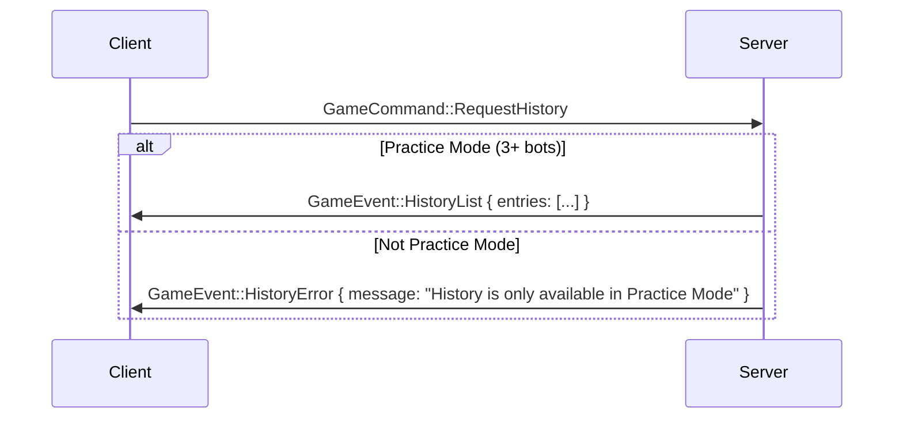
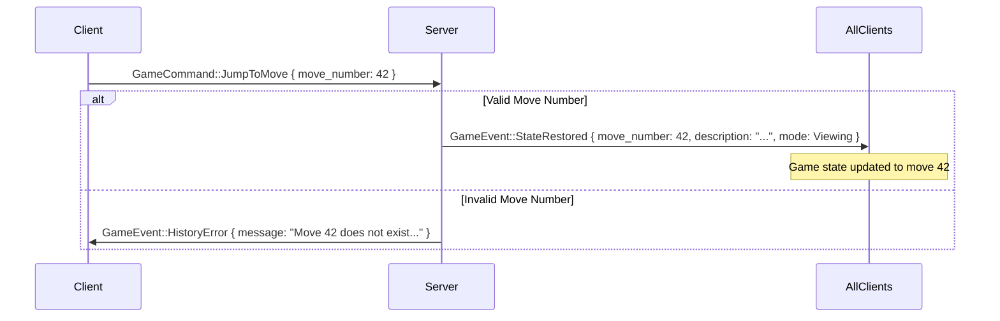
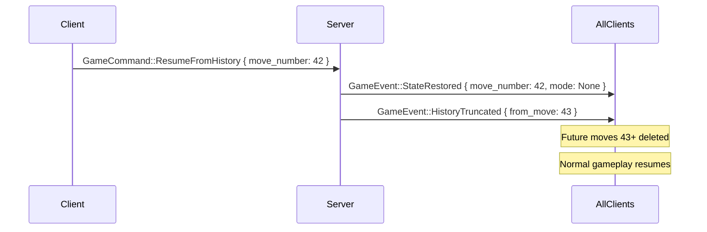
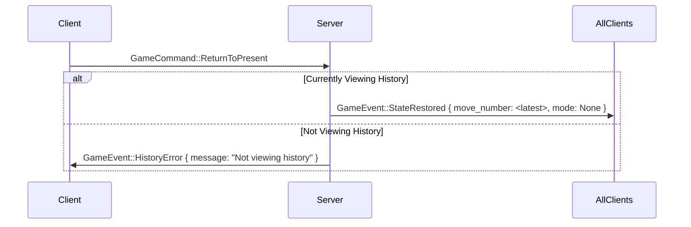

# History Viewer: Frontend Integration Guide

**Status:** Ready for Implementation
**Created:** 2026-01-11
**Backend Status:** ✅ Complete (Phase 1-6)
**TypeScript Bindings:** ✅ Generated
**Prerequisites:** [16-history-viewer-implementation-plan.md](16-history-viewer-implementation-plan.md)

## Overview

This guide provides a framework-agnostic contract for integrating the History Viewer feature into any frontend (React, Vue, Svelte, vanilla TS, etc.). The backend is complete and fully tested; this document serves as the integration specification.

## Table of Contents

1. [TypeScript Types](#typescript-types)
2. [WebSocket Message Flow](#websocket-message-flow)
3. [Command Examples](#command-examples)
4. [Event Handling Examples](#event-handling-examples)
5. [State Management Considerations](#state-management-considerations)
6. [Error Handling](#error-handling)
7. [UI/UX Patterns](#uiux-patterns)
8. [Testing Recommendations](#testing-recommendations)

---

## TypeScript Types

### Generated Bindings Location

All TypeScript types are auto-generated from Rust using `ts-rs`:

```text
apps/client/src/types/bindings/generated/
├── GameCommand.ts        (includes history commands)
├── GameEvent.ts          (includes history events)
├── MoveAction.ts
├── HistoryMode.ts
└── MoveHistorySummary.ts
```

### Key Types Reference

```typescript
// From GameCommand.ts
type GameCommand =
  | { RequestHistory: { player: Seat } }
  | { JumpToMove: { player: Seat; move_number: number } }
  | { ResumeFromHistory: { player: Seat; move_number: number } }
  | { ReturnToPresent: { player: Seat } }
  | ... // other commands

// From GameEvent.ts
type GameEvent =
  | { HistoryList: { entries: MoveHistorySummary[] } }
  | { StateRestored: { move_number: number; description: string; mode: HistoryMode } }
  | { HistoryTruncated: { from_move: number } }
  | { HistoryError: { message: string } }
  | ... // other events

// From MoveHistorySummary.ts
interface MoveHistorySummary {
  move_number: number;
  timestamp: string; // ISO 8601 DateTime
  seat: Seat;
  action: MoveAction;
  description: string;
}

// From HistoryMode.ts
type HistoryMode =
  | "None"
  | { Viewing: { at_move: number } }
  | { Paused: { at_move: number } };

// From MoveAction.ts
type MoveAction =
  | { DrawTile: { tile: Tile; visible: boolean } }
  | { DiscardTile: { tile: Tile } }
  | { CallTile: { tile: Tile; meld_type: MeldType } }
  | { PassTiles: { direction: PassDirection; count: number } }
  | { DeclareKong: { tiles: Tile[] } }
  | { ExchangeJoker: { joker: Tile; replacement: Tile } }
  | { DeclareWin: { pattern_name: string; score: number } }
  | { CallWindowOpened: { tile: Tile } }
  | "CallWindowClosed"
  | "CharlestonCompleted";
```

---

## WebSocket Message Flow

### Requesting History



### Jumping to a Move



### Resuming from History



### Returning to Present



---

## Command Examples

### Vanilla TypeScript

```typescript
import { GameCommand } from './types/bindings/generated/GameCommand';
import { Seat } from './types/bindings/generated/Seat';

// Assuming you have a WebSocket connection
const socket: WebSocket = /* your socket */;
const currentSeat: Seat = "East"; // or from game state

// Request full history list
function requestHistory() {
  const command: GameCommand = {
    RequestHistory: { player: currentSeat }
  };
  socket.send(JSON.stringify(command));
}

// Jump to a specific move (view mode)
function jumpToMove(moveNumber: number) {
  const command: GameCommand = {
    JumpToMove: { player: currentSeat, move_number: moveNumber }
  };
  socket.send(JSON.stringify(command));
}

// Resume gameplay from a move (truncates future)
function resumeFromHistory(moveNumber: number) {
  const command: GameCommand = {
    ResumeFromHistory: { player: currentSeat, move_number: moveNumber }
  };
  socket.send(JSON.stringify(command));
}

// Return to present (exit history view)
function returnToPresent() {
  const command: GameCommand = {
    ReturnToPresent: { player: currentSeat }
  };
  socket.send(JSON.stringify(command));
}
```

### Framework-Agnostic Wrapper

```typescript
// historyClient.ts
import { GameCommand } from './types/bindings/generated/GameCommand';
import { Seat } from './types/bindings/generated/Seat';

export class HistoryClient {
  constructor(
    private socket: WebSocket,
    private getCurrentSeat: () => Seat
  ) {}

  requestHistory(): void {
    this.send({ RequestHistory: { player: this.getCurrentSeat() } });
  }

  jumpToMove(moveNumber: number): void {
    this.send({ JumpToMove: { player: this.getCurrentSeat(), move_number: moveNumber } });
  }

  resumeFromMove(moveNumber: number): void {
    this.send({ ResumeFromHistory: { player: this.getCurrentSeat(), move_number: moveNumber } });
  }

  returnToPresent(): void {
    this.send({ ReturnToPresent: { player: this.getCurrentSeat() } });
  }

  private send(command: GameCommand): void {
    this.socket.send(JSON.stringify(command));
  }
}

// Usage:
// const historyClient = new HistoryClient(socket, () => gameState.currentSeat);
// historyClient.requestHistory();
```

---

## Event Handling Examples

### Event Handler Implementation

```typescript
import { GameEvent } from './types/bindings/generated/GameEvent';
import { MoveHistorySummary } from './types/bindings/generated/MoveHistorySummary';
import { HistoryMode } from './types/bindings/generated/HistoryMode';

// WebSocket message handler
socket.onmessage = (event) => {
  const gameEvent: GameEvent = JSON.parse(event.data);

  if ('HistoryList' in gameEvent) {
    handleHistoryList(gameEvent.HistoryList.entries);
  } else if ('StateRestored' in gameEvent) {
    handleStateRestored(
      gameEvent.StateRestored.move_number,
      gameEvent.StateRestored.description,
      gameEvent.StateRestored.mode
    );
  } else if ('HistoryTruncated' in gameEvent) {
    handleHistoryTruncated(gameEvent.HistoryTruncated.from_move);
  } else if ('HistoryError' in gameEvent) {
    handleHistoryError(gameEvent.HistoryError.message);
  }
  // ... handle other events
};

function handleHistoryList(entries: MoveHistorySummary[]): void {
  console.log(`Received ${entries.length} history entries`);
  // Update UI: populate history panel list
  // Store in state management
}

function handleStateRestored(moveNumber: number, description: string, mode: HistoryMode): void {
  console.log(`State restored to move ${moveNumber}: ${description}`);

  if (mode === 'None') {
    // Back to normal gameplay
    // Update UI: hide history banner, enable controls
  } else if ('Viewing' in mode) {
    // Viewing history at move_number
    // Update UI: show "Viewing Move X" banner, disable game actions
  } else if ('Paused' in mode) {
    // Paused at history point (not currently used in implementation)
    // Update UI: show "Paused at Move X" banner
  }
}

function handleHistoryTruncated(fromMove: number): void {
  console.log(`History truncated from move ${fromMove} onward`);
  // Update UI: remove moves >= fromMove from history panel
  // Show notification: "97 future moves discarded"
}

function handleHistoryError(message: string): void {
  console.error(`History error: ${message}`);
  // Update UI: show error toast/notification
}
```

### Event Handler with Type Guards

```typescript
// historyEventHandler.ts
import { GameEvent } from './types/bindings/generated/GameEvent';

export type HistoryEventCallbacks = {
  onHistoryList: (entries: MoveHistorySummary[]) => void;
  onStateRestored: (moveNumber: number, description: string, mode: HistoryMode) => void;
  onHistoryTruncated: (fromMove: number) => void;
  onHistoryError: (message: string) => void;
};

export function handleGameEvent(
  event: GameEvent,
  callbacks: Partial<HistoryEventCallbacks>
): boolean {
  if ('HistoryList' in event) {
    callbacks.onHistoryList?.(event.HistoryList.entries);
    return true;
  }
  if ('StateRestored' in event) {
    const { move_number, description, mode } = event.StateRestored;
    callbacks.onStateRestored?.(move_number, description, mode);
    return true;
  }
  if ('HistoryTruncated' in event) {
    callbacks.onHistoryTruncated?.(event.HistoryTruncated.from_move);
    return true;
  }
  if ('HistoryError' in event) {
    callbacks.onHistoryError?.(event.HistoryError.message);
    return true;
  }
  return false; // Not a history event
}

// Usage:
// handleGameEvent(event, {
//   onHistoryList: (entries) => setHistory(entries),
//   onStateRestored: (move, desc, mode) => updateHistoryMode(mode),
//   onHistoryError: (msg) => toast.error(msg),
// });
```

---

## State Management Considerations

### Recommended State Structure

Regardless of framework, you'll need to track:

```typescript
interface HistoryState {
  // Full history list (received from HistoryList event)
  entries: MoveHistorySummary[];

  // Current history viewing mode
  mode: HistoryMode;

  // Current move number being viewed (if in history mode)
  currentMove: number | null;

  // Total number of moves in game
  totalMoves: number;

  // UI state
  isPanelOpen: boolean;
  isAutoPlaying: boolean;
  playbackSpeed: 1 | 2 | 4;

  // Error state
  lastError: string | null;
}

// Initial state
const initialHistoryState: HistoryState = {
  entries: [],
  mode: 'None',
  currentMove: null,
  totalMoves: 0,
  isPanelOpen: false,
  isAutoPlaying: false,
  playbackSpeed: 1,
  lastError: null,
};
```

### State Updates on Events

```typescript
// Pseudocode for state updates

// On HistoryList event:
state.entries = event.entries;
state.totalMoves = event.entries.length;

// On StateRestored event:
state.mode = event.mode;
state.currentMove = event.move_number;

if (event.mode === 'None') {
  // Back to present
  state.currentMove = null;
  state.isAutoPlaying = false;
}

// On HistoryTruncated event:
state.entries = state.entries.filter((e) => e.move_number < event.from_move);
state.totalMoves = state.entries.length;

// On HistoryError event:
state.lastError = event.message;
// Show error notification
```

### State Synchronization

**Important:** The server broadcasts `StateRestored` to ALL clients when any player jumps to a move. This means:

- **All players see the same historical state**
- **All players' UI must update together**
- **This is intentional:** History is a shared experience in practice mode

```typescript
// Your state management must handle this:
socket.onmessage = (event) => {
  const gameEvent = JSON.parse(event.data);

  if ('StateRestored' in gameEvent) {
    // This event is broadcast to ALL players
    // Update YOUR UI even if you didn't request the jump
    updateLocalState(gameEvent.StateRestored);
  }
};
```

---

## Error Handling

### Common Error Cases

| Error Message                                    | Cause                                            | UI Action                                                          |
| ------------------------------------------------ | ------------------------------------------------ | ------------------------------------------------------------------ |
| `"History is only available in Practice Mode"`   | User tried to access history in multiplayer      | Show toast: "History is only available in Practice Mode (3+ bots)" |
| `"Move 999 does not exist (game has 142 moves)"` | Invalid move number                              | Show toast: "Cannot jump to move 999 (only 142 moves recorded)"    |
| `"Not viewing history"`                          | User tried to return to present when not viewing | Show toast: "You are not viewing history"                          |

### Error Handling Pattern

```typescript
function handleHistoryError(message: string): void {
  // Log for debugging
  console.error('[History Error]', message);

  // Parse error message for user-friendly display
  let userMessage = message;

  if (message.includes('Practice Mode')) {
    userMessage = 'History is only available in Practice Mode';
  } else if (message.includes('does not exist')) {
    // Extract move numbers from error message
    const match = message.match(/Move (\d+).*\(game has (\d+) moves\)/);
    if (match) {
      userMessage = `Cannot jump to move ${match[1]} (game only has ${match[2]} moves)`;
    }
  } else if (message.includes('Not viewing history')) {
    userMessage = 'You are not currently viewing history';
  }

  // Show to user (toast, alert, banner, etc.)
  showErrorNotification(userMessage);

  // Clear error after display
  setTimeout(() => clearError(), 5000);
}
```

---

## UI/UX Patterns

### Recommended UI Components

#### 1. History Panel (Sidebar or Modal)

```text
┌─────────────────────────────────────────┐
│ Move History                      [×]   │
├─────────────────────────────────────────┤
│ 📜 142 moves recorded                   │
├─────────────────────────────────────────┤
│ ▶ Move 0 - East drew a tile           │
│ ▶ Move 1 - East discarded 3D          │
│ ▶ Move 2 - South drew a tile          │
│ ...                                     │
│ ► Move 42 - West called Pung of 5C    │  ← Currently viewing
│ ▶ Move 43 - West discarded 7B         │
│ ...                                     │
│ ▶ Move 141 - East declared Mahjong    │
├─────────────────────────────────────────┤
│ [◀ Prev] [▶ Next] [⏮ Return to Present]│
└─────────────────────────────────────────┘
```

**Features:**

- Scrollable list of all moves
- Click any move to jump to it
- Highlight current move
- Show human-readable descriptions
- Show timestamp and seat for each move
- Navigation controls at bottom

#### 2. History Mode Banner (Top of Game Board)

```text
┌──────────────────────────────────────────────────┐
│ 🕒 Viewing Move 42 of 142 - West called Pung    │
│ [◀ Prev] [▶ Next] [⏸ Resume Here] [⏭ Present]  │
└──────────────────────────────────────────────────┘
```

**Behavior:**

- Show when `HistoryMode` is `Viewing` or `Paused`
- Hide when `HistoryMode` is `None`
- Display current move number and description
- Provide quick navigation controls

#### 3. Playback Controls (Optional)

```text
┌─────────────────────────────────┐
│ ◀◀ ◀ ▶ ▶▶        Speed: [1x ▼] │
└─────────────────────────────────┘
```

**Features:**

- Auto-advance through moves (call `jumpToMove(current + 1)` on timer)
- Speed control: 1x, 2x, 4x (adjust timer interval)
- Pause/Play toggle
- Skip to first/last move

#### 4. Resume Confirmation Dialog

```text
┌─────────────────────────────────────────┐
│ Resume from Move 42?                    │
├─────────────────────────────────────────┤
│ This will discard 100 future moves.    │
│ This action cannot be undone.           │
├─────────────────────────────────────────┤
│            [Cancel]  [Resume]           │
└─────────────────────────────────────────┘
```

**Trigger:** When user clicks "Resume Here" button
**Action:** Call `resumeFromHistory(moveNumber)` on confirm

### Keyboard Shortcuts (Recommended)

| Key     | Action                  |
| ------- | ----------------------- |
| `H`     | Toggle history panel    |
| `←`     | Previous move           |
| `→`     | Next move               |
| `Esc`   | Return to present       |
| `Space` | Play/Pause auto-advance |

### Visual States

#### Normal Gameplay (HistoryMode: None)

- Game board fully interactive
- No history banner shown
- History panel shows "0 moves recorded" or full list
- "View History" button available

#### Viewing History (HistoryMode: Viewing)

- Game board in read-only mode (disable all action buttons)
- History banner shows "Viewing Move X of Y"
- History panel highlights current move
- Navigation controls enabled

#### Truncation Warning (Before Resume)

- Calculate: `futureMovesCount = totalMoves - currentMove - 1`
- Show confirmation: "Discard {futureMovesCount} future moves?"
- Emphasize irreversibility

---

## Testing Recommendations

### Unit Tests (Frontend)

```typescript
describe('HistoryClient', () => {
  it('sends RequestHistory command with correct player seat', () => {
    // Test command serialization
  });

  it('sends JumpToMove with correct move_number', () => {
    // Test command serialization
  });
});

describe('History Event Handlers', () => {
  it('updates state on HistoryList event', () => {
    // Test state updates
  });

  it('shows error toast on HistoryError event', () => {
    // Test error handling
  });

  it('updates mode and current move on StateRestored', () => {
    // Test state transitions
  });
});
```

### Integration Tests (With Mock WebSocket)

```typescript
describe('History Feature Integration', () => {
  let mockSocket: MockWebSocket;
  let historyClient: HistoryClient;

  beforeEach(() => {
    mockSocket = new MockWebSocket();
    historyClient = new HistoryClient(mockSocket, () => 'East');
  });

  it('requests history and receives list', async () => {
    historyClient.requestHistory();

    // Simulate server response
    mockSocket.receiveMessage({
      HistoryList: {
        entries: [
          /* mock entries */
        ],
      },
    });

    // Assert state was updated
    expect(historyState.entries).toHaveLength(5);
  });

  it('jumps to move and receives StateRestored', async () => {
    historyClient.jumpToMove(42);

    mockSocket.receiveMessage({
      StateRestored: {
        move_number: 42,
        description: 'West called Pung of 5C',
        mode: { Viewing: { at_move: 42 } },
      },
    });

    expect(historyState.mode).toEqual({ Viewing: { at_move: 42 } });
    expect(historyState.currentMove).toBe(42);
  });
});
```

### End-to-End Tests

```typescript
describe('History Viewer E2E', () => {
  it('allows player to view full game history', async () => {
    // 1. Start practice mode game
    // 2. Play 10 moves
    // 3. Click "View History" button
    // 4. Verify history panel shows 10 entries
    // 5. Click move 5
    // 6. Verify board state reflects move 5
    // 7. Click "Return to Present"
    // 8. Verify board shows current state
  });

  it('allows player to resume from history', async () => {
    // 1. View history
    // 2. Jump to move 5
    // 3. Click "Resume Here"
    // 4. Confirm in dialog
    // 5. Verify future moves 6-10 are deleted
    // 6. Play a new move
    // 7. Verify new move is #6 in history
  });
});
```

---

## Practice Mode Detection

### Server-Side Logic

The server determines practice mode via:

```rust
fn is_practice_mode(&self) -> bool {
    self.bot_seats.len() >= 3  // 3 or 4 bots = practice mode
}
```

**Practice Mode Scenarios:**

- 1 human + 3 bots ✅
- 0 humans + 4 bots ✅
- 2 humans + 2 bots ❌ (not practice mode)

### Frontend Detection

You don't need to detect practice mode on the frontend. The server will send `HistoryError` if the user tries to access history in non-practice mode.

**Recommended UI Approach:**

```typescript
// Option 1: Always show history button, let server reject
// (Simpler, server-authoritative)
<button onClick={() => historyClient.requestHistory()}>
  View History
</button>

// Option 2: Hide history button in non-practice mode
// (Requires tracking bot count on frontend)
{isPracticeMode && (
  <button onClick={() => historyClient.requestHistory()}>
    View History
  </button>
)}

// Option 3: Show disabled button with tooltip
<button
  onClick={() => historyClient.requestHistory()}
  disabled={!isPracticeMode}
  title={!isPracticeMode ? "History only available in Practice Mode" : ""}
>
  View History
</button>
```

**Recommendation:** Use Option 1 for simplicity. Let the server enforce the rule and show the error toast if needed.

---

## Performance Considerations

### Backend Performance (Already Optimized)

- **History Recording:** <5ms per entry (append-only Vec)
- **Jump to Move:** <50ms (direct snapshot lookup)
- **Memory:** ~500-750KB per game (acceptable for practice mode)

### Frontend Performance Considerations

#### Large History Lists

If a game has 500+ moves, rendering all entries in the history panel may cause performance issues.

**Solutions:**

1. **Virtual Scrolling:** Only render visible items

   ```typescript
   // Use libraries like:
   // - react-window
   // - react-virtual
   // - Vue Virtual Scroller
   // - @tanstack/virtual
   ```

2. **Pagination:** Show 50 moves at a time

   ```typescript
   const pageSize = 50;
   const currentPage = Math.floor(currentMove / pageSize);
   const visibleEntries = entries.slice(currentPage * pageSize, (currentPage + 1) * pageSize);
   ```

3. **Search/Filter:** Allow user to filter by seat or action type

   ```typescript
   const filteredEntries = entries.filter((entry) =>
     selectedSeat ? entry.seat === selectedSeat : true
   );
   ```

#### StateRestored Event Processing

`StateRestored` event includes the full game state (Table snapshot). This can be a large JSON payload (~2.5KB).

**Optimization:**

```typescript
// Don't store the full Table in frontend state
// The server manages the authoritative state
// Frontend only needs to know:
// 1. Current move number
// 2. History mode
// 3. Description

type LightweightHistoryState = {
  currentMove: number | null;
  mode: HistoryMode;
  description: string;
};

// The full game state is already in your main game state
// You don't need to duplicate it
```

---

## WebSocket Connection Handling

### Reconnection Scenario

If the WebSocket connection drops while viewing history:

```typescript
socket.onclose = () => {
  console.log('WebSocket closed');

  // Reset history state to avoid stale data
  resetHistoryState();

  // Attempt reconnection
  reconnect();
};

socket.onopen = () => {
  console.log('WebSocket reconnected');

  // Re-request history if panel was open
  if (historyState.isPanelOpen) {
    historyClient.requestHistory();
  }
};
```

### Multiple Tabs (Same Game)

If the user has multiple tabs open for the same game:

- Each tab has its own WebSocket connection
- Server broadcasts `StateRestored` to ALL connections
- All tabs will jump to the same historical state simultaneously

**This is correct behavior:** History viewing is a shared experience.

---

## Example Implementations

### React Hook Example

```typescript
// useHistoryViewer.ts
import { useState, useCallback, useEffect } from 'react';
import { MoveHistorySummary, HistoryMode } from './types/bindings/generated';
import { HistoryClient } from './historyClient';

export function useHistoryViewer(historyClient: HistoryClient | null) {
  const [entries, setEntries] = useState<MoveHistorySummary[]>([]);
  const [mode, setMode] = useState<HistoryMode>('None');
  const [currentMove, setCurrentMove] = useState<number | null>(null);
  const [isPanelOpen, setIsPanelOpen] = useState(false);
  const [error, setError] = useState<string | null>(null);

  // Event handlers
  const handleHistoryList = useCallback((newEntries: MoveHistorySummary[]) => {
    setEntries(newEntries);
    setIsPanelOpen(true);
  }, []);

  const handleStateRestored = useCallback(
    (moveNumber: number, description: string, newMode: HistoryMode) => {
      setMode(newMode);
      setCurrentMove(moveNumber);
    },
    []
  );

  const handleHistoryTruncated = useCallback((fromMove: number) => {
    setEntries((prev) => prev.filter((e) => e.move_number < fromMove));
  }, []);

  const handleHistoryError = useCallback((message: string) => {
    setError(message);
    setTimeout(() => setError(null), 5000);
  }, []);

  // Commands
  const requestHistory = useCallback(() => {
    historyClient?.requestHistory();
  }, [historyClient]);

  const jumpToMove = useCallback(
    (moveNumber: number) => {
      historyClient?.jumpToMove(moveNumber);
    },
    [historyClient]
  );

  const resumeFromMove = useCallback(
    (moveNumber: number) => {
      if (confirm(`Resume from move ${moveNumber}? This will discard future moves.`)) {
        historyClient?.resumeFromMove(moveNumber);
      }
    },
    [historyClient]
  );

  const returnToPresent = useCallback(() => {
    historyClient?.returnToPresent();
  }, [historyClient]);

  // Navigation helpers
  const canGoPrevious = currentMove !== null && currentMove > 0;
  const canGoNext = currentMove !== null && currentMove < entries.length - 1;

  const goToPrevious = useCallback(() => {
    if (canGoPrevious && currentMove !== null) {
      jumpToMove(currentMove - 1);
    }
  }, [canGoPrevious, currentMove, jumpToMove]);

  const goToNext = useCallback(() => {
    if (canGoNext && currentMove !== null) {
      jumpToMove(currentMove + 1);
    }
  }, [canGoNext, currentMove, jumpToMove]);

  const isViewing = mode !== 'None';

  return {
    // State
    entries,
    mode,
    currentMove,
    isPanelOpen,
    error,
    isViewing,
    canGoPrevious,
    canGoNext,

    // Actions
    requestHistory,
    jumpToMove,
    resumeFromMove,
    returnToPresent,
    goToPrevious,
    goToNext,
    setIsPanelOpen,

    // Event handlers (expose for WebSocket listener)
    handleHistoryList,
    handleStateRestored,
    handleHistoryTruncated,
    handleHistoryError,
  };
}
```

### Vue Composable Example

```typescript
// useHistoryViewer.ts (Vue)
import { ref, computed } from 'vue';
import { MoveHistorySummary, HistoryMode } from './types/bindings/generated';
import { HistoryClient } from './historyClient';

export function useHistoryViewer(historyClient: HistoryClient | null) {
  const entries = ref<MoveHistorySummary[]>([]);
  const mode = ref<HistoryMode>('None');
  const currentMove = ref<number | null>(null);
  const isPanelOpen = ref(false);
  const error = ref<string | null>(null);

  // Event handlers
  function handleHistoryList(newEntries: MoveHistorySummary[]) {
    entries.value = newEntries;
    isPanelOpen.value = true;
  }

  function handleStateRestored(moveNumber: number, description: string, newMode: HistoryMode) {
    mode.value = newMode;
    currentMove.value = moveNumber;
  }

  function handleHistoryTruncated(fromMove: number) {
    entries.value = entries.value.filter((e) => e.move_number < fromMove);
  }

  function handleHistoryError(message: string) {
    error.value = message;
    setTimeout(() => (error.value = null), 5000);
  }

  // Commands
  function requestHistory() {
    historyClient?.requestHistory();
  }

  function jumpToMove(moveNumber: number) {
    historyClient?.jumpToMove(moveNumber);
  }

  function resumeFromMove(moveNumber: number) {
    if (confirm(`Resume from move ${moveNumber}?`)) {
      historyClient?.resumeFromMove(moveNumber);
    }
  }

  function returnToPresent() {
    historyClient?.returnToPresent();
  }

  // Computed
  const canGoPrevious = computed(() => currentMove.value !== null && currentMove.value > 0);
  const canGoNext = computed(
    () => currentMove.value !== null && currentMove.value < entries.value.length - 1
  );
  const isViewing = computed(() => mode.value !== 'None');

  function goToPrevious() {
    if (canGoPrevious.value && currentMove.value !== null) {
      jumpToMove(currentMove.value - 1);
    }
  }

  function goToNext() {
    if (canGoNext.value && currentMove.value !== null) {
      jumpToMove(currentMove.value + 1);
    }
  }

  return {
    entries,
    mode,
    currentMove,
    isPanelOpen,
    error,
    isViewing,
    canGoPrevious,
    canGoNext,
    requestHistory,
    jumpToMove,
    resumeFromMove,
    returnToPresent,
    goToPrevious,
    goToNext,
    handleHistoryList,
    handleStateRestored,
    handleHistoryTruncated,
    handleHistoryError,
  };
}
```

---

## Summary Checklist

### Backend (Already Complete) ✅

- [x] History data structures
- [x] Command handlers
- [x] Event emission
- [x] Practice mode enforcement
- [x] Error handling
- [x] Tests (24 tests passing)

### Frontend Integration (Your Tasks) 📋

- [ ] Generate TypeScript bindings (`cargo test export_bindings`)
- [ ] Create `HistoryClient` wrapper class
- [ ] Wire up WebSocket event handlers
- [ ] Implement state management (store/context/composable)
- [ ] Build History Panel component
- [ ] Build History Mode Banner component
- [ ] Add keyboard shortcuts (optional)
- [ ] Add playback controls (optional)
- [ ] Add confirmation dialogs
- [ ] Write unit tests
- [ ] Write integration tests
- [ ] Test with real server

---

## References

- [Backend Implementation Plan](16-history-viewer-implementation-plan.md)
- [Command/Event System Design](../architecture/06-command-event-system-api-contract.md)
- [State Machine Design](../architecture/04-state-machine-design.md)
- Backend Source: `crates/mahjong_server/src/network/history.rs`
- Backend Tests: `crates/mahjong_server/tests/history_integration_tests.rs`

---

**Ready for Frontend Implementation!** 🚀

This guide provides everything needed to integrate the History Viewer into any frontend framework. The backend is fully functional and tested; follow the patterns above to build a responsive, type-safe UI.
